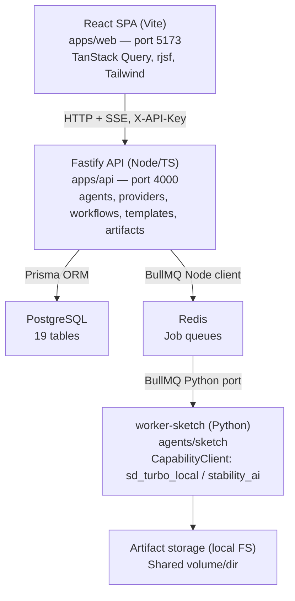

# Agentry — Project Handover Document

This is the single document to read when taking ownership of this project. It describes the system **as actually built and verified running**, not as designed — where this document and the design blueprint in [./](./) disagree, this document and the code win. See [15-as-built-deltas.md](15-as-built-deltas.md) for the explicit list of differences.

---

## 1. What Agentry is

Agentry is a self-hosted **AI Agent Platform**: one system for running self-contained AI capabilities ("Agents") behind a single shared contract, instead of building a new standalone app for every AI feature. The platform provides, generically for any agent:

- **An agent registry** — agents are discovered from `agents/<id>/manifest.json` files at API boot and surface automatically in the UI.
- **BYOK provider management** — each agent step declares a *capability* it needs (e.g. `image-generation`); the operator configures one or more *providers* per capability (a free local model, or a premium API with their own key) and can switch between them per-submission with zero code changes. API keys are AES-256-GCM encrypted at rest.
- **Workflow execution** — submissions become queued jobs (Redis/BullMQ) processed by Python workers, with live progress streamed to the browser over SSE, retry/attempt history, and an audit event trail.
- **Saved, reusable multi-step templates** — a user composes a sequence of steps (each step = one agent run) in the UI, saves it, and re-runs it later with new inputs. Step wiring is validated at save time against what each agent actually produces.
- **Generic artifact storage** — whatever an agent produces (images today; video, JSON, anything later) is stored, checksummed, and downloadable through the same three endpoints, and rendered by mime-type in the UI.

**One real agent is registered today: Sketch Agent** — text-to-image generation via a local SD-Turbo model (free, CPU-only, no API key needed) or a configured Stability AI key, selected through the UI. A second agent (Video Agent, wrapping the sibling [VSplitter](../VSplitter) project) is fully designed in [08-agent-video.md](08-agent-video.md) but intentionally **not implemented** — VSplitter remains a separate, standalone, working application.

---

## 2. Architecture (as built)



**Key architectural rules (each has an ADR in [decisions/](decisions/)):**

1. **Agents run as separate Python worker processes**, never in-process Node functions (ADR-0001). Node only enqueues jobs and reads back results via BullMQ events. Both sides speak the same Redis protocol because the workers use the official Python port of BullMQ (ADR-0003).
2. **The manifest is the contract.** Everything the platform knows about an agent comes from its `manifest.json` (steps, JSON Schemas for inputs/outputs, required capabilities, artifact kinds, retry policy). The frontend generates submission forms from the schema (via `@rjsf/core`) and the template builder derives its field editors from it — a new agent needs zero platform/UI code changes.
3. **Provider resolution happens in Node at enqueue time** — the worker receives a ready-to-use `providerContext` (with decrypted key) in the job payload; workers never query Postgres. A submission needing an unconfigured capability is rejected `422` before any job runs. Jobs are removed from Redis the moment they settle (`removeOnComplete`/`removeOnFail`) so the decrypted key's exposure window is exactly the job's active lifetime.
4. **Templates sit one layer above workflows and never modify them** (ADR-0008): each template step runs one agent's own unmodified workflow to completion; a small orchestration module listens for workflow completion and starts the next step, resolving its inputs from run inputs and/or earlier steps' artifacts. Steps are an ordered list with forward-only references — cycle-free by construction, no graph engine (ADR-0005).

### Request flow, end to end (Sketch generation)

1. User fills the schema-generated form at `/agents/sketch-agent/submit`, optionally picking a non-default provider → `POST /projects/:id/workflows`.
2. API validates, resolves the provider for `image-generation` (explicit choice → project default → global default; `422` if none), creates `workflow` + `workflow_steps` + `job` rows, enqueues a BullMQ job (payload includes `providerContext`).
3. `worker-sketch` picks it up, dispatches through `CapabilityClient` (local diffusers pipeline kept warm across jobs, or a remote REST call), writes the PNG to artifact storage, reports progress, returns the result envelope.
4. API's `QueueEvents` listener persists progress/completion to Postgres (`job_runs`, `artifacts` with sha256 + size, `events`), relays progress to the browser via `GET /jobs/:id/events` (SSE), and — if this workflow belongs to a template run — starts the next template step.
5. UI shows the live progress bar, then renders the image from `GET /artifacts/:id/download`.

---

## 3. Repository layout

```
Agentry/
  docs/                        <- design blueprint (01-14), deltas (15), handover (00), ADRs
    00-handover.md           <- this document
  apps/
    api/                       <- Fastify + Prisma (schema: prisma/schema.prisma)
      src/modules/{agents,providers,workflows,templates,artifacts,settings,projects,jobs}
      src/queue/                <- BullMQ setup, event listener, SSE relay
      src/auth/                  <- static API-key middleware
      tests/                      <- vitest unit tests
    web/                        <- React SPA (src/pages/*, src/api/{client,types,queries}.ts)
                                   Design system: src/components/ui/* (token-based, shadcn-style),
                                   app shell: src/components/shell/* (sidebar/topbar/⌘K palette),
                                   theming: CSS variables in src/index.css + src/lib/theme.tsx
                                   (dark default, light toggle, ?theme= URL override)
  agents/
    sketch/                     <- manifest.json, schemas/, worker.py, Dockerfile, tests/
  python/
    sdk/                        <- agent_job.py, runner.py, providers.py (CapabilityClient)
  artifacts/                    <- local artifact storage (gitignored)
```

---

## 4. Configuration reference

All configuration is via environment variables (see `.env.example`):

| Variable | Used by | Meaning |
|---|---|---|
| `DATABASE_URL` | api | Postgres connection string. Local dev uses port **5433** (5432 was occupied by an unrelated native Postgres on the original dev machine). |
| `REDIS_URL` | api, worker | Redis connection. Local dev uses the machine's native Redis on 6379; the compose stack uses its own internal `redis` service. |
| `AGENTRY_CREDENTIALS_KEY` | api | **32-byte base64 master key** (`openssl rand -base64 32`) encrypting provider API keys at rest. Losing it makes stored provider secrets unrecoverable (re-enter them); leaking it + a DB dump exposes them. Never commit it. |
| `AGENTRY_API_KEY` | api, web build | The single static API key every request must present (`X-API-Key` header; `?key=` query param for SSE/downloads, which can't set headers). The web image bakes it in at build time via the `VITE_AGENTRY_API_KEY` build arg. |
| `AGENTS_DIR` | api | Where the registry scans for `*/manifest.json` (default: repo `agents/`; `/agents` in the container). |
| `ARTIFACTS_DIR` | api, worker | Artifact storage root (default: repo `artifacts/`; a shared volume in compose). |
| `PORT` | api | API port, default **4000** (3000 was occupied on the original dev machine). |

**Security model (Phase 1, honest statement):** single-operator. One static API key is the only auth — no users, sessions, or RBAC. Provider-key encryption protects against database/backup leakage, **not** against compromise of the API host itself. Real auth is the first roadmap item ([14-roadmap.md](14-roadmap.md)).

---

## 5. Runbook

### Fully containerized (recommended for a fresh machine)

```bash
cp .env.example .env         # fill AGENTRY_CREDENTIALS_KEY + AGENTRY_API_KEY
docker compose up -d --build
```

Web UI: `http://localhost:5173` - API: `http://localhost:4000`. The API container runs `prisma migrate deploy` automatically on start. First Sketch generation downloads the SD-Turbo weights (~2.5GB) into the `sketch_model_cache` volume — subsequent runs are warm (~10-20s per 512×512 image on CPU).

### Local development (hot reload)

```bash
docker compose up -d postgres           # port 5433; assumes native redis on 6379
cd apps/api && npm install && npx prisma migrate deploy && npx tsx watch src/server.ts
cd apps/web && npm install && npx vite  # port 5173, proxies /api -> :4000
# worker:
cd agents/sketch && python3 -m venv .venv && source .venv/bin/activate \
  && pip install -r requirements.txt && cd ../.. \
  && REDIS_URL=redis://localhost:6379 ARTIFACTS_DIR=$PWD/artifacts python agents/sketch/worker.py
```

Don't run the containerized `api`/`web`/`worker-sketch` at the same time as the local loop — same ports.

### Common operations

| Task | How |
|---|---|
| Add/change an agent | Edit files under `agents/<id>/`, **restart the API** (registry scans at boot only — no hot reload, by design, ADR-0006) and start its worker. |
| Rotate the client API key | Change `AGENTRY_API_KEY`, restart api, rebuild web (key is baked into the SPA at build time). |
| DB migrations | `cd apps/api && npx prisma migrate dev --name <name>` (dev) / `npx prisma migrate deploy` (apply). |
| Backup | `pg_dump` the `agentry` database + copy the artifacts directory/volume. The credentials master key must be backed up separately (it is *not* in the DB). |
| Clean up disk | Artifacts are **never auto-deleted** (deliberate — see `10-deployment.md`). Delete old projects via the API/UI (cascades clean up DB rows) and remove their folders under `artifacts/`. |
| Logs | API logs to stdout (Fastify/pino). Worker logs to stdout. Job attempt history/errors: `GET /jobs/:id` (the `logs` DB table exists but workers don't write to it yet — see §8). |

### Troubleshooting

- **`401 missing or invalid API key`** — send `X-API-Key: <AGENTRY_API_KEY>` (or `?key=` for SSE/download URLs).
- **`422 no provider configured for required capability`** — expected guard: add/activate a provider for that capability at `/providers` (the seed `sd_turbo_local` default is created automatically at API boot).
- **`500 AGENTRY_CREDENTIALS_KEY must decode to exactly 32 bytes`** — regenerate with `openssl rand -base64 32`.
- **Job stuck `queued`** — the agent's worker isn't running or can't reach Redis. Check the worker process/container logs.
- **Health check** — `GET /health` (no auth) reports live DB + Redis connectivity.

---

## 6. API reference (as implemented — 60 endpoints)

Auth is **dual-accept**: every endpoint (except `/health`, `/version`, and the auth bootstrap routes `/auth/setup-status|setup|login`) takes EITHER the static `X-API-Key` header / `?key=` param (owner-equivalent, unchanged from Phase 1 — workers, curl, SSE links keep working) OR an `agentry_session` cookie from the browser login flow. Base URL `http://localhost:4000` (or `/api/...` through the web app's proxy).

| Area | Endpoints | Notes |
|---|---|---|
| Meta | `GET /health`, `GET /version` | No auth. Health checks DB + Redis. |
| Agents | `GET /agents` - `GET /agents/:id` | Registry list / full manifest with resolved schemas. |
| Capabilities | `GET /capabilities` | Closed set: `image-generation`, `text-generation` (seeded at boot). |
| Providers | `GET /providers?capability=` - `POST /providers` - `GET/PUT/DELETE /providers/:id` - `POST /providers/:id/set-default` | Secrets are write-only: responses carry `hasSecret`, never the key. `POST` body: `{capabilityKey, providerType, name, baseUrl?, authMode, secret?, config?, isDefault?, scope?, projectId?}`. |
| Projects | `GET/POST /projects` - `GET/PATCH/DELETE /projects/:id` | Delete cascades to workflows/templates/artifacts rows. |
| Workflows | `POST /projects/:id/workflows` - `GET /workflows/:id` - `GET /workflows/:id/steps` - `POST /workflows/:id/steps/:stepKey/advance` - `POST /workflows/:id/cancel` | Submit body: `{agentId, input, providerConfigId?}`. `advance` unblocks a `humanGate` step (no registered agent uses one yet). Cancel removes queued jobs; a mid-execution job finishes but the workflow ends `cancelled`. |
| Jobs | `GET /jobs/:id` - `GET /jobs/:id/logs` - `GET /jobs/:id/events` | `/events` is an SSE stream (`progress`/`completed`/`failed`). |
| Artifacts | `GET /workflows/:id/artifacts` - `GET /artifacts/:id` - `GET /artifacts/:id/download` | Rows include kind, mimeType, sizeBytes, sha256 checksum. |
| Templates | `GET/POST /projects/:id/templates` - `GET/PUT/DELETE /templates/:id` - `POST /templates/:id/validate` - `POST /templates/:id/run` - `GET /template-runs/:id` - `POST /template-runs/:id/cancel` | Save is a hard validation gate (kind-compatibility of `fromStep` mappings); run re-checks pinned agent versions and `409`s on drift. |
| Settings | `GET /settings?projectId=&agentId=` - `PUT /settings` | Project-scoped rows override global for the same `(agentId, key)`. |
| Stats | `GET /stats/overview` - `GET /stats/agents` - `GET /stats/system` | Read-only dashboard aggregates: counters, success rate, avg duration, 14-day completion series, per-agent rollups, and API/DB/Redis/worker liveness (worker detection reads Redis `CLIENT LIST` since the Python BullMQ port isn't visible to Node's `getWorkers()`). `costSavedEstUsd` is a labeled estimate (completed image jobs × $0.04) — provider-per-job is not persisted. |
| Events | `GET /events?limit=&projectId=` - `GET /workflows/:id/events` | Activity feed (newest-first, `job.progress` excluded server-side) and per-workflow chronological timeline (unions workflow-scoped and job-scoped rows, since `job.*` events carry a null `workflowId`). |
| Listings | `GET /workflows/recent?limit=&status=` - `GET /artifacts?limit=&projectId=&kind=` | Cross-project recent executions (with duration + thumbnail artifact id) and flat artifact gallery listing. `GET /projects` responses now include `counts`, `lastActivityAt`, and `coverArtifactId`. |
| Auth | `GET /auth/setup-status` - `POST /auth/setup` - `POST /auth/login` - `POST /auth/logout` - `GET /auth/me` | First-run creates the owner (`needsSetup` keys off passwordHash existence, so the pre-auth stub user doesn't block it; replay → 409). Sessions: 30-day httpOnly SameSite=Lax cookie; DB stores only the sha256 of the token. Passwords: bcryptjs cost 10. |
| Users | `GET/POST /users` - `PATCH/DELETE /users/:id` | Owner-only (API-key callers count as owner). Guards: cannot demote/delete the last passworded owner, cannot self-delete; deleting a user reassigns their projects to the stub user. |
| Prompts | `GET /prompts?agentId=` - `POST /prompts` - `DELETE /prompts/:id` | Versioned prompt library on the previously-unused `prompts` table; POST auto-increments version per (agentId, key). Surfaced in the UI at /prompts and inline on agent submit forms. |
| Cost/Series | `GET /stats/costs?days=` - `GET /stats/series?days=` | Real per-provider spend from job attribution (`jobs.provider_config_id/provider_type`, written at enqueue; older jobs report as `unattributedJobs`) with editable `pricing.*` settings; day×status series for the Analytics page. |
| Agent Studio | `POST /agents/scaffold` - `POST /agents/rescan` | Scaffold writes `agents/<id>/` (manifest, schemas, worker.py stub, Dockerfile) with slug+path-prefix guards (409 on existing dir), then rescans. Rescan re-runs the boot manifest scan without an API restart (concurrent calls share one scan). Requires the API running from the repo — compose mounts `agents/` read-only. |

Template step `inputMapping` values (per input field): `{"kind":"literal","value":...}` - `{"kind":"fromRunInput","field":"<name>"}` - `{"kind":"fromStep","stepOrder":N,"artifactKind":"<kind>"}` (forward-only references).

---

## 7. Data model (20 Postgres tables)

Authoritative source: [../apps/api/prisma/schema.prisma](../apps/api/prisma/schema.prisma). Narrative documentation: [05-database-schema.md](05-database-schema.md).

- **Core execution:** `users` (real accounts since Phase 2: unique email, bcrypt passwordHash, owner/member role; the pre-auth stub row remains for API-key-created projects) + `sessions` (hashed 30-day tokens) → `projects` → `workflows` (one agent run, agent version pinned) → `workflow_steps` → `jobs` (1:1 with step, BullMQ id, + `provider_config_id`/`provider_type` attribution for costs) → `job_runs` (one per attempt) → `logs`. `artifacts` (+`artifact_versions`) hang off steps; `events` is the audit trail.
- **Providers:** `capabilities` (closed enum, seeded) → `provider_configs` (encrypted secret, global/project scope, default flag).
- **Templates:** `templates` → `template_steps` (agent + version pinned at save, schema/kinds snapshotted) → `template_runs` → `template_run_steps` (each links to the real `workflows` row it spawned).
- **Config:** `settings` (scoped key/value; `pricing.*` global keys drive the Cost Monitor), `prompts` (versioned prompt library — CRUD at /prompts, unique on (agentId, key, version)).
- Deletes cascade along ownership edges (project → everything under it); `events`/`template_run_steps` references null out rather than block.

---

## 8. Known limitations and what is deliberately not built

Honest list — none of these are hidden surprises, all are deliberate scope decisions with rationale in the docs:

1. **Minimal multi-user auth (Phase 2), not full RBAC.** Email+password login with DB-backed sessions and owner/member roles exists (`users` gained name/passwordHash/role + unique email; new `sessions` table; first-run /setup flow). Role checks apply only to user management — everything else is all-or-nothing once authenticated, and the static API key remains an owner-equivalent root credential for programmatic use. Per-resource authorization is still roadmap; harden before exposing to untrusted users.
2. **Video Agent not implemented** — designed only. VSplitter stays standalone. Consequently the `text-generation` capability has no consuming agent and no adapter (`generate_text()` raises `NotImplementedError` by design).
3. **Provider adapters implemented: `sd_turbo_local` and `stability_ai`.** `openai_compatible`, `anthropic`, `replicate` are modeled as valid `provider_type` values but have no adapter yet (Replicate needs an async/polling adapter — see `docs/15`). The Stability adapter is verified to dispatch/authenticate against the real API but has not been exercised with a paid key end-to-end.
4. **Templates are strictly sequential** — no branching, conditionals, or parallel fan-out (ADR-0005; roadmap item). With one registered agent, cross-agent chaining is architecturally supported (`fromStep` artifact wiring, validated at save) but has no real consumer yet.
5. **Workers don't write to the `logs` table** — `GET /jobs/:id/logs` returns empty; stdout + `job_runs.error` are the debugging surfaces today.
6. **No artifact retention automation** — disk grows until you clean up manually (documented policy).
7. **Mid-execution jobs can't be interrupted** — cancel prevents queued/next work; an actively-running generation finishes first.
8. **SSE relay is in-process** — correct for the single API replica this deploys as; scaling to multiple API replicas would need a shared pub/sub (roadmap).
9. **Registry reloads only at API restart** (no hot-reload, ADR-0006).
10. **CPU-only inference** — SD-Turbo at ~10-20s/image after warm load; the first job after worker start pays model-load time. GPU support would be a worker/container concern, not a platform change.

The forward-looking priority order for all deferred work is [14-roadmap.md](14-roadmap.md).

---

## 9. Testing & verification status

| Suite | Command | Status |
|---|---|---|
| API unit tests (template validation, secret crypto, manifest scanning, stats/cost aggregation, agent scaffolding, session hashing) | `cd apps/api && npx vitest run` | 33/33 passing, no infra needed |
| Sketch integration (real SD-Turbo inference) | `source agents/sketch/.venv/bin/activate && python -m pytest agents/sketch/tests/` | 1/1 passing; auto-skips if model not cached |
| TypeScript | `npx tsc --noEmit` in `apps/api` and `apps/web` | Clean |
| Docker images | `docker compose build` | All three build (api 699MB, web 93MB, worker 8.35GB) |

Manually verified end-to-end (see git history for the verification narrative): prompt → queued job → SSE progress → real generated image → download with checksum; provider add/set-default/swap incl. a real (rejected) remote API call; template save-validation rejection, save, run producing two distinct images sequentially; cancel-while-queued removing the Redis job; project delete cascading; all UI pages rendering live data.

---

## 10. Design documentation map

The `docs/` tree is the architecture blueprint the build followed (written first, deliberately):

- **Read first:** `01-product-vision` → `02-architecture-overview` → `03-agent-sdk-contract` (the core abstraction) → `07-agent-implementation-guide` (**how to add an agent** — the platform's main extension point).
- **Subsystems:** `04` workflows/jobs, `05` database, `06` API (as-designed; §6 above is as-built), `08` Video Agent (future), `09` Sketch Agent, `10` deployment, `11` testing, `12` security, `13` observability.
- **What changed between blueprint and build:** [15-as-built-deltas.md](15-as-built-deltas.md).
- **Why key decisions were made:** `decisions/0001-0009` (short ADRs; 0008/0009 cover the two subsystems added after the original blueprint).
- **What to build next and in what order:** `14-roadmap`.
